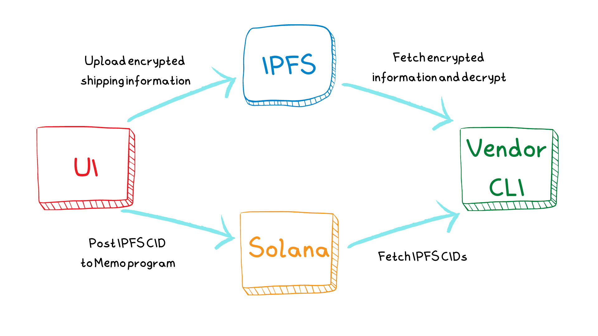

<h1 align="center">Serverless Merch</h1>
<br />
<p align="center">

</p>
<p align="center">
<a href="https://twitter.com/bonfida">

</a>
</p>

<br />

<p align="center">
<strong>
Easily create and distribute merch to your community without any backend server
</strong>
</p>


<div align="center">


</div>

<br />
<h2 align="center">Table of contents</h2>
<br />

1. [Introduction](#introduction)
2. [CLI](#cli)
   - [Conditions](#fetching-orders)
   - [Fetching orders](#fetching-orders)
   - [Generator vendor config](#fetching-orders)
   - [Generator payment config](#fetching-orders)
3. [UI](#ui)

<br />
<a name="introduction"></a>
<h2 align="center">Introduction</h2>
<br />

```
git clone git@github.com:Bonfida/serverless-merch.git
cd serverless-merch
```

This repository aims to provide an easy way to Solana communities to create and distribute merch to their communities. It is made of:

- A command line interface (CLI) that can be used to:
  - Fetch orders and save them on .csv file
  - Create vendor configuration file
  - Create a RSA keypair
- A demo UI:
  - Built with React + Typescript + Tailwind
  - Can be adapted to any merch/goodie

<br />

<br />

The program works a follow:

1. User enters shipping information in the UI
2. User information is encrypted with the RSA publickey of the vendor
3. The **encrypted** data is uploaded on IPFS
4. The user send a transaction made of
   - Instruction 1: A token transfer to the vendor address
   - Instruction 2: A Memo program instruction with the IPFS CID
5. The vendor fetches all the transaction made to it's fee address
6. Transactions are parsed:
   - Verify the token amount transfered
   - Extract the IFPS CID
   - Optional: Verify conditions on the user (set by the vendor)
7. Fetch encrypted data from IPFS
8. Decrypt data and save to disk

<br />
<a name="cli"></a>
<h2 align="center">CLI</h2>
<br />

To run the CLI:

```
cd cli
yarn && yarn dev
```

<br />
<a name="conditions"></a>
<h3 align="center">Conditions</h3>
<br />

A vendor can set arbitrary conditions on users that submit orders. For instance this can used to verify that the order was submitted by a user that hold a particular NFT, has a certain amount of tokens or own domain names.

A condition is defined as:

```ts
type Condition = (arg: PublicKey) => Promise<boolean>;
```

A vendor can define several conditions and evaluate them by defining a condition array:

```ts
export const CONDITIONS: Condition[] = [condition_1, condition_1];
```

<br />
<a name="fetching-orders"></a>
<h3 align="center">Fetching orders</h3>
<br />

Fetching submitted orders can be done with the CLI. The results will be saved on disk in 3 files:

- `errors_orders.csv`: Orders that could not be decrypted
- `invalid_orders.csv`: Orders that failed for one of the following reason
  - User did not send enough enough tokens (i.e did not pay the right price)
  - User does not meet the conditions set by the vendor
  - RPC connection error while fetching transaction information
  - Could not find the memo in the transaction
- `valid_orders.csv`: CSV file that contains valid orders information

<br />
<a name="vendor-config"></a>
<h3 align="center">Generating vending configuration</h3>
<br />

A vendor config is a RSA keypair i.e a set of public and private keys. The CLI can be used to create a new keypair or load an existing keypair from it's path. Keypairs generated from the CLI have a key length of 4,096 bytes.

This keypair will be used to encrypt the the user information and decrypt them when fetching orders.

<br />
<a name="payment-config"></a>
<h3 align="center">Generating payment configuration</h3>
<br />

A payment config is a JSON file containing the following information:

```typescript
export interface VendorConfig {
  address: string;
  price: number;
}
```

For example if you want to receive USDC to `3emsAVdmGKERbHjmGfQ6oZ1e35dkf5iYcS6U4CPKFVaa` and that the price of each item is 20 USDC (USDC has 6 decimals) the config file will be

```json
{
  "address": "3emsAVdmGKERbHjmGfQ6oZ1e35dkf5iYcS6U4CPKFVaa",
  "price": 20000000
}
```

The CLI can be used to create a new configuration or load an existing JSON file from it's path.

<br />
<a name="ui"></a>
<h2 align="center">UI</h2>
<br />


```
cd ui
yarn && yarn start
```

The environment file must contain the following variables

```
REACT_APP_CONNECTION_DEV= The RPC URL for your dev enviroment
REACT_APP_CONNECTION= The RPC URL for your production build
REACT_APP_COLLECT_FEES= The address used to collect fees
GENERATE_SOURCEMAP=false
```
